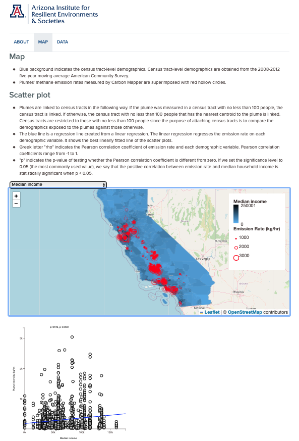



## Job Market Paper

["Adaptation to Weather Shocks and Household Beliefs on Climate: Evidence from California"](https://papers.ssrn.com/sol3/papers.cfm?abstract_id=3892429) (*new version coming soon!*)

Abstract: Using a difference-in-difference framework, I show that California households exposed to a severe heat wave are differentially more likely to adopt central air conditioning units than those less exposed, controlling for historical climate. Using these "induced adopters" to predict take-up, I show that induced adopters have a significant increase in their summer energy demand 3 years following the heat wave, with insignificant effects on their winter electricity demand. In addition, I present a theoretical framework where household belief-updating about the climate rationalizes household learning about the climate that cannot be explained by myopia or alternative channels.

## Working Papers

["The Global Impacts of Climate Change on Risk Preferences"](https://papers.ssrn.com/sol3/papers.cfm?abstract_id=4132517) (with [Remy Levin](https://sites.google.com/view/remy-levin))

Abstract: We study the direct impacts that long-run experiences of climate change have on individual risk preferences. Using panel surveys from Indonesia and Mexico (total N = 25,000), we link within-person changes in elicited risk preferences to state-level, lifetime experiences of climate change. In line with the predictions of a Bayesian model of learning over background climate risk, we find that in both settings, increases in the experienced means of temperature and precipitation cause significant decreases in measured risk aversion, while increases in the experienced variance of temperature in Indonesia and the variance of precipitation in Mexico lead to significant increases in measured risk aversion. We replicate this analysis globally using a survey with a representative sample from 75 countries (N = 75,000) containing an elicited measure of risk preference which we link to country-level, lifetime climate experiences. We find significant results for both the means and variances of both climate variables that are consistent with our panel analyses. Across all settings, experiences of climate variance have first-order effects, with coefficient magnitudes of the standard deviation of climate 0.6-2.6 times that of the climate mean. We develop a novel method for estimating the welfare effects of observed risk preference changes using panel data, and find that the climate-induced changes in risk preferences we observe increased welfare in both Indonesia and Mexico by approximately 1%.

---

["Inundated by Change: The Effects of Land Use on Flood Damages"](https://papers.ssrn.com/sol3/papers.cfm?abstract_id=4142761)

Abstract: Proper land-use policy can help mitigate damages from natural disasters. Management of such policy occurs at different geographic levels, with potential implications for optimal management given the level of aggregation. This study examines this by quantifying the effects of land-use change on flood damages in the state of Texas. I link claims data from the National Flood Insurance Program to a series of land-use changes to construct a tract-by-month panel, and use exogenous variation in precipitation across tract-months to estimate the effect of changes in land use on the frequency and magnitude of new flood insurance claims. I find that increases in impervious surface development within a tract increase flood insurance claims, while increases in water coverage and other natural covers decrease these claims. In addition, using variation in tract-level elevation, I show that land-use change in neighboring geographies—particularly those uphill—affects own-tract flood insurance claims. Overall, these results suggest existence of spatial spillovers from land-use changes within a geography, and imply returns to coordination in land-use policy across geographies.  

---

## Publications

"Revisiting the Link Between Economic Distress, Race, and Domestic Violence." Journal of Interpersonal Violence. 2020, Vol. 35(19-20) pp. 4141-4151 (with J. Sebastian Leguizamon and Susane Leguizamon)

---

## Works in Progress

"A Historical Measure of Risk Preferences" (with [Remy Levin](https://sites.google.com/view/remy-levin) and [Daniela Vidart](https://www.danielavidart.com))

"Impacts of Maternal Exposure to PFAS on Infant Health Outcomes" (with [Robert Baluja](https://www.robertbaluja.com), [Bo Guo](https://has.arizona.edu/people/bo-guo), [Ashley Langer](https://www.ashleylanger.com), and [Derek Lemoine](https://www.dereklemoine.com))

"Directed technical change in energy and choice of market policy"

"International spillover in secondary car market regulation: Evidence from a German scrappage policy"

___

## Press Coverage

AC work highlighted in [The Conversation](https://theconversation.com/4-ways-extreme-heat-hurts-the-economy-164382)

___

## Other Collaborations

[Carbon Plotter](https://carbon-plotter.air.arizona.edu)

In a joint collaboration between Carbon Mapper and the University of Arizona Institute for Resilient Environments & Societies ([AIRES](https://environment.arizona.edu/aires)), we have made publicly available data on methane plumes from Carbon Mapper's remote-sensing flyovers linked to tract-level Census demographics. With this, individuals can explore how these plumes co-vary with demographics in California (coverage across the Permian Basin and the southeast United States coming soon). Researchers are able to download the full underlying data, with plume coverage updating on a regular basis as new data are collected.

